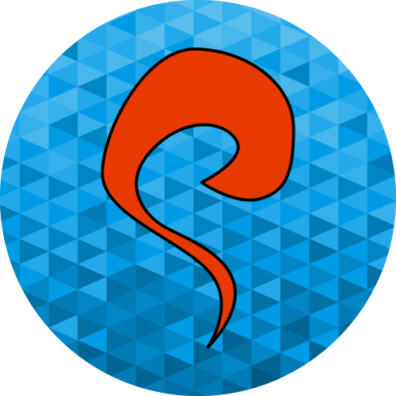

# ZENgine &emsp; 

## What is ZENgine?

ZENgine is a WIP 2D game engine with some very basic features. It's based on an [ECS](https://en.wikipedia.org/wiki/Entity_component_system) architecture and developed using a data-driven and data-oriented design.

The engine uses the OpenGL API and the SDL2 Library. It can run on Windows and macOS. 

## Motivation
I'm always been a game engine enthusiast (not so much about creating a videogame XD) but sadly is not my primary focus in my working life.
I've created some experimental game engine for android, the first with Java and the second in C++ and some engine for the web using the Canvas API and later the WebGL API.

In the last year I've discovered RUST and in now it's my favorite language (sadly in my everyday work it's not used :disappointed_relieved:). So to learn RUST I've decided, as a personal project, that write a game engine from scratch could be a great idea (spoiler, it's not).

Also to increase my ability to expose and explain my work I've created a youtube series on which I try to explain the whole developing process.

## Youtube Series
The making of ZENgine is shown through a series on youtube videos (sorry only in Italian :smirk:)

https://www.youtube.com/playlist?list=PL-88NuvRRCqAPrkxlIH3bFdNiKTYhZbuj